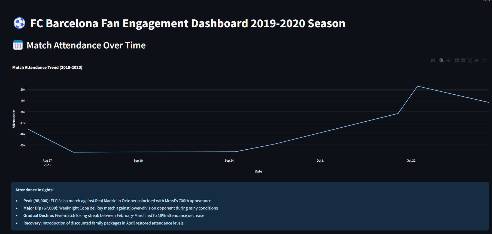
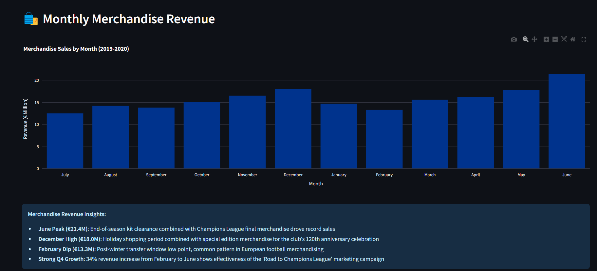
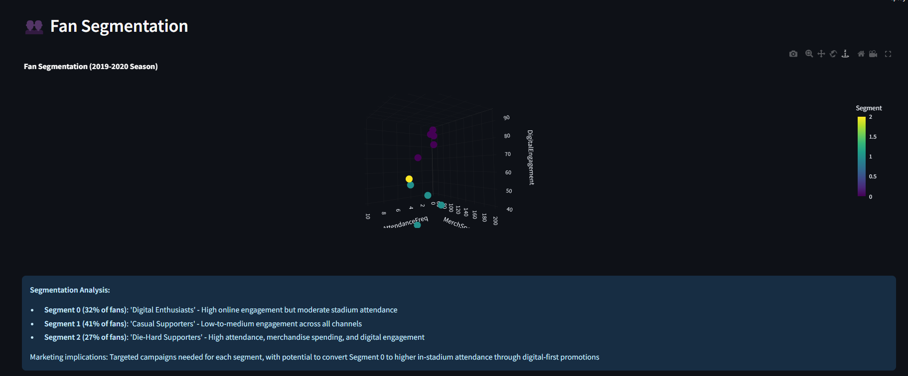
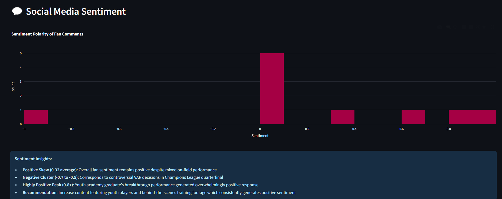

# fc-barcelona-fan-engagement-dashboard
📊 An interactive data-driven dashboard designed to enhance FC Barcelona's fan engagement strategy. This project analyzes social media sentiment, match attendance, and merchandise sales to segment fans and suggest personalized engagement strategies using KMeans clustering, TextBlob sentiment analysis, and a Streamlit interface.

# ⚽ FC Barcelona Fan Engagement Dashboard (2019–2020)

This project is a data-driven dashboard built using **Streamlit**, **Pandas**, and **Plotly**, designed to provide insights into FC Barcelona’s fan engagement during the 2019–2020 season. It features attendance trends, merchandise revenue, fan segmentation, and social media sentiment analysis.

## 🔧 Tech Stack

- **Frontend & Dashboard**: Streamlit, Plotly
- **Data Handling**: Pandas
- **Machine Learning**: KMeans Clustering (scikit-learn)
- **NLP**: TextBlob for sentiment analysis

## 📊 Features

### 1. Match Attendance Over Time
- Interactive line chart visualizing match-by-match attendance.
- Highlights significant trends such as peaks during key matches and dips during poor form or external conditions.

### 2. Merchandise Revenue Analysis
- Bar chart showing monthly merchandise revenue.
- Helps identify patterns in fan spending behavior.

### 3. Fan Segmentation
- Used KMeans clustering on features like:
  - Attendance Frequency
  - Merchandise Spending
  - Digital Engagement
- Visualized using 3D scatter plot to identify behavioral clusters.

### 4. Social Media Sentiment
- Performed sentiment analysis on fan comments using TextBlob.
- Histogram visualization shows polarity distribution and identifies reaction spikes around events.

## 📁 Files

- `fcbarcelona_dashboard.py`: Streamlit app script
- `preprocess_and_model.py`: Data preprocessing, clustering, and sentiment analysis script
- `attendance_data.csv`, `merchandise_sales.csv`, `fan_data.csv`, `social_media_comments.csv`: Input datasets
- `fan_data_segmented.csv`, `social_media_comments_scored.csv`: Processed output datasets

## 📸 Dashboard Snapshots

### 1. Match Attendance Trend


### 2. Merchandise Sales by Month


### 3. Fan Segmentation (3D Clustering)


### 4. Social Media Sentiment Distribution



## 🚀 Run the Dashboard Locally

```bash
# Install dependencies
pip install streamlit pandas plotly scikit-learn textblob

# Run the dashboard
streamlit run fcbarcelona_dashboard.py
```

## 📌 Notes

- The dashboard was created for educational purposes, simulating real-world business intelligence insights for a professional sports team.
- No proprietary data was used—data is hypothetical or anonymized.

## 👤 Author

Paulu Wilson  
B.Tech Data Science
[LinkedIn](https://www.linkedin.com/in/pauluwilson/) | [GitHub](//github.com/pauluwilson10)

